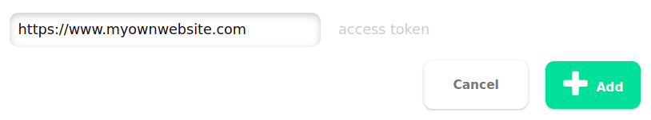
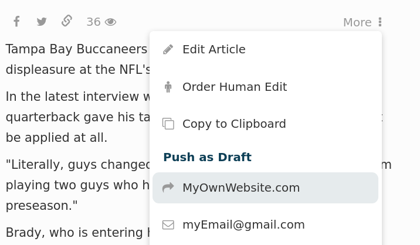

============
API
============

The API endpoints are for our business customers to migrate and store generated content,
they are not for serving the content for a website nor are they suitable for on-demand
access. Thus the access limits are strict, we recommend our clients to maintain their own
backend and database, access the monok api periodically to refresh their database with
newly generated content.

API-Key
------------

The API endpoints are accessible to users that have inserted a payment method.
The service is accessed through a unique API key provided to each user. 
The API key is a token that a client provides when making API calls. 
The are two ways to add the key in your request, the key can be added
in the request header as such:

Request articles by Feed ID (businessfeed1) ::

    $ curl -XGET -i 'https://www.monok.com/api/v1/feed?q=businessfeed1'
    -H "Content-Type: application/json"
    -H "x-api-token: [ API KEY ]"
    
Request articles by Feed ID (businessfeed1) with the API key in a query parameter::    

    $ curl -XGET -i 'https://www.monok.com/api/v1/feed?q=businessfeed1&apikey=[ API KEY ]'

News Article API
------------
Search for original news articles from publishers much like the Google News API or similar services. The articles are returned as a JSON.
This API Endpoint requires the News Article API Product.

**Type:** GET-Request
**Example:** https://www.monok.com/api/v1/articles/?q=politics&f=20&sort=date&entities=true

===================	===========	================================================================================================
 Param                    Default     	  Description                        
===================   	===========	================================================================================================
q	          			| An Article Search Query (example:‘entertainment’ or ‘organization:samsung‘), 
					| learn more about the `Query Selector`_    
s (optional)      	10		| The number of articles returned (s=1 return 1 article, s=20 
	          			| returns 20 articles after the first 35 articles)
f (optional)      	0		| The offset (f=0 return the first 10 articles, f=35 
	          			| returns 10 articles or your chosen s-parameter number of articles, 
					| after the first 35 articles) 
c (optional)      	all		| A filter of comma-separated category
                  			| names. (example: ‘business,politics’),
                  			| default is all categories.
sort (optional)   	popularity	| The type of sort you wish the list of generated content 
                  			| to have, either ‘popularity’ for most popular first or ‘date’ for
		  			| latest articles first.
entities (optional)     false		| A boolean (true/false) for returning named entities in the article. (example: ‘entities=true’),
                  			| A list of all available named entities is found in the `Query Selector`_ page
characters (opt)   	200		| Articles are by default returned with a short 200 character snippet of
                  			| the original article text, to expand this you can set this character limit
full (optional)   	false		| Articles are by default returned with a short snippet of the original article text,
                  			| to see the full article text, set this parameter to true
===================   	===========	================================================================================================

Clustered News Stories API
------------
Search for clusters of original news articles, the returned stories will have multiple news article sources, 
all of which report on the same news event. The clustered articles are returned as a JSON.
This API Endpoint requires the Clustered News Stories API Product.

**Type:** GET-Request
**Example:** https://www.monok.com/api/v1/clusters/?q=politics&f=20&sort=date&entities=true

===================	===========	================================================================================================
 Param                    Default     	  Description                        
===================   	===========	================================================================================================
q	          			| An Article Search Query (example:‘entertainment’ or ‘organization:samsung‘),
					| learn more about the `Query Selector`_  
s (optional)      	10		| The number of articles returned (s=1 return 1 article, s=20 
	          			| returns 20 articles after the first 35 articles)
f (optional)      	0		| The offset (f=0 return the first 10 articles, f=35 
	          			| returns 10 articles or your chosen s-parameter number of articles, 
					| after the first 35 articles) 
c (optional)      	all		| A filter of comma-separated category
                  			| names. (example: ‘business,politics’),
                  			| default is all categories.
sort (optional)   	popularity	| The type of sort you wish the list of generated content 
                  			| to have, either ‘popularity’ for most popular first or ‘date’ for
		  			| latest articles first.
entities (optional)     false		| A boolean (true/false) for returning named entities in the article. (example: ‘entities=true’),
                  			| A list of all available named entities is found in the `Query Selector`_ page
===================   	===========	================================================================================================

Feed API
------------
You may access the content of a feed as a JSON with this request,
Depending on what kind of plugin you've chosen for the feed, you'll get clustered articles, scraped articles or generated articles.
You must have some access to the feed and provide the feed Id.

**Type:** GET-Request
**Example:** https://www.monok.com/api/v1/feed/?q=en&f=20&sort=date&c=business

If you're running an article generation feed but wish to see the scraped articles, you can force the endpoint to return the scraped articles instead by using the "product" param.

===================   	==================================================================
 Param                       Description                        
===================   	==================================================================
q	          	The Id of the feed (example:‘myPoliticsNews’)            
f (optional)      	The offset (f=0 return the first 10 articles, f=35 
	          	returns 10 articles after the first 35 articles), default is 0         
c (optional)      	A filter of comma-separated category
                  	names. (example: ‘business,politics’),
                  	default is all categories.
sort (optional)   	The type of sort you wish the list of generated content 
                  	to have, either ‘popularity’ for most popular first or ‘date’ for
		  	latest articles first, default is popularity.
product (optional)  	Chose what kind of content to return (generated articles, 
			clustered articles or scraped articles), 
			the default is the dominant plugin you've chosen.
===================   	==================================================================

Article API
------------
This endpoint will return the entire article and all its meta-data as a JSON.

**Type:** GET-Request
**Example:** https://www.monok.com/api/v1/puff/band-lady-a-files-legal-action-against-blues-singer-anita-lady-a-white

===============   ===================================================
 URL Endpoint       https://www.monok.com/api/v1/puff/​[article Id]                        
===============   ===================================================

Push Article API
------------

Any article can be pushed to your backend-system from our frontend using our Push Article API. It's essentially an integration method.
All you need to do is open up an API endpoint in your own backend with the suffix **/monok**, the endpoint should also take a token to verify the request is coming from your monok account, that token is always your API-key unless you've explicitly inputed a custom token in your settings page.

**Type:** POST-Request
**Example:** https://www.myOwnWebsite.com/monok

Monok will use this method to push out an article to your backend ::

    $ curl -XPOST -i https://www.myOwnWebsite.com/monok'
    -H "Content-Type: applicatiGETon/json"
    -H "token: [ API-Key ]"

Enter the endpoint as an intergration under settings

You will then be able to push your articles from the dropdown menu of any article as such:

This is also how articles can be pushed automatically to your website once a human edit is complete and submitted.

Article Text Format
---------------------
The article text is formatted using markdown with occasional JSON injections representing widgets, that is: Embeded Tweets, Instagram posts, Youtube videos or Quotes. Here's an example of how a tweet can look like injected into an article.

.. code-block:: JSON

	{
	"data": [
	{
	"name": "unknown",
	"text": "Had good calls this week with leaders at Sony. I confirmed our intent to honor all existing agreements upon acquisition of Activision Blizzard and our desire to keep Call of Duty on PlayStation. Sony is an important part of our industry, and we value our relationship.January 20, 2022"
	}
	],
	"weight": 1,
	"id": "1484273335139651585",
	"avatar": "https://twitter.com/XboxP3/profile_image?size=bigger",
	"type": "twitter",
	"url": "https://twitter.com/XboxP3/status/1484273335139651585",
	"username": "XboxP3"
	}
      
We recommend spliting the article text at every newline (**\\n**) and validating whether the item is markdown text or a JSON object.
Depending on which it is, you can compile the markdown to HTML and the JSON object to your own HTML compiler. For wordpress for instance, markdown should be compiled to HTML and JSON should be evaluated, for twitter objects and youtube object, inserting the url field is sufficient for wordpress to understand that this is an embeded tweet or youtube video, whilst for instagram post, you will need to insert an iframe directed to the url.

We recommend using `Drawdown`_ by Adam Legget, as it is small (~4 KB), and compiles Monok articles well, into HTML.

Featured Image
**********************
An article JSON also comes with a thumbnail url, this is the easiest way to download the visual focus object - more commonly known as a "featured image" - as a photo, whether it's a video screenshot or just another photo. Sometimes however, you will be presented with another field in the JSON, a "thumbImageData" field. This is a base64 encoding of a PNG photo. You should always try to favor this photo over any thumbnail url or visual focus object. This is the whole photo provided to you for storing in your image database, as a PNG file.

If you're not interested in re-building the article text into HTML for your Strapi or Wordpress integration, then we recommend using the HTML field in the JSON, this field provides you with the whole article, as a wordpress ready HTML rendition.

Send Back Data
**********************
When an article is published on your system, you have the option to send information about the article back to Monok. The are several benefits to doing this.

1. You will double-link the articles so you may access the published article from Monok
2. When new articles are published, they will include links to previously published articles
3. If you make edits or changes to the text, future AI generated articles will learn from these edits and improve 

The target url is /api/v1/linkback, it takes a POST request with the following JSON body:

.. code-block:: JSON

	{
	"puff":{
		"title":"Governor Greg Abbott on Texas repercussion of severe winter weather",
		"article":"Governor Greg Abbott to be briefed on the effects of heavy winter weather on Texas at the Alternate State Operations Center [...]"
	},
	"id":"1t8e9-governor-greg-abbott-on-texas-repercussion-of-severe-winter-weather",
	"url": "https://www.natureclimatechange.com/governor-greg-abbott-on-texas-repercussion-of-severe-winter-weather/",
	"source": "natureclimatechange.com",
	"userId":"natureclimatechange.com-WP",
	"thumbnail": "https://www.natureclimatechange.com/wp-content/uploads/2022/02/3187562f6efb196adeb207e62f392f44_testcollage.png"
	}

The "id" refers to the Monok article Id, whilst the userId is just a unique identifier, we propose the domain name plus an identifier for your website, WP for wordpress for instance or Strapi for Strapi-based CMS.

.. _`Query Selector`: https://docs.monok.com/en/latest/articlequeryselector.html
.. _`Drawdown`: https://github.com/adamvleggett/drawdown
