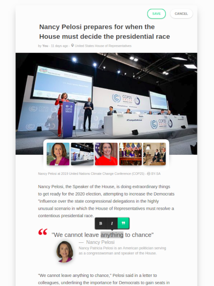

Edit Mode
========

If you own an article, you can also edit its generated content. By clicking on the **More** dropdown menu and choosing *Edit* you will enter a drafting edit mode, where you can change the following:

- Choosing a different photo from a list of relevant photos
- The Headline
- The Article Text
- Inserting Tweets, Instagram posts, Videos into the article texts
- Adding Links
- Formatting the texts with sub-headings, bold etc

.. raw:: html

    

        <iframe src="https://www.youtube.com/embed/NjFgU8eM428" frameborder="0" allowfullscreen style="position: absolute; top: 0; left: 0; width: 100%; height: 100%;"></iframe>
    

Any changes you make will be stored and used for teaching Monok to write more articles the way you want them to be.

