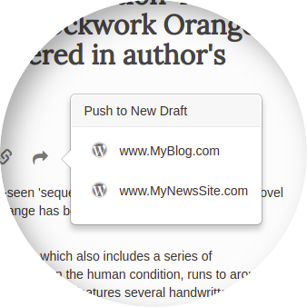

Integration with Wordpress
========

There are multiple ways of integrating with established publishing tools
Monok allows the user to automatically generate a draft from
the chosen article, by pushing the content to their system of
choice.

Wordpress
--------

A wordpress plugin is available that allows you to push out any article of your choice to your wordpress admin as a new draft.

Features
------------

- Automatic Category setup
- Automatic Featured Image setup
- Quotes are styled according to your theme
- All embeded content is pushed (Youtube Video, Instagram Post, Twitter Post etc)

Installation
------------

1. Download this `wordpress plugin`__ and install it in your wordpress admin for the website you wish to integrate with

.. _`wordpress plugin`: https://restsocialexample.com/static/plugins/MonokSync.zip

__ `wordpress plugin`_

2. Go to your `monok profile`__ and add the url of your Wordpress admin to your list of wordpress websites.

.. _`monok profile`: https://www.monok.com/profile

__ `monok profile`_

That's it, you can then start pushing out articles by opening up an article, pressing push to wordpress and chosing your wordpress url.
