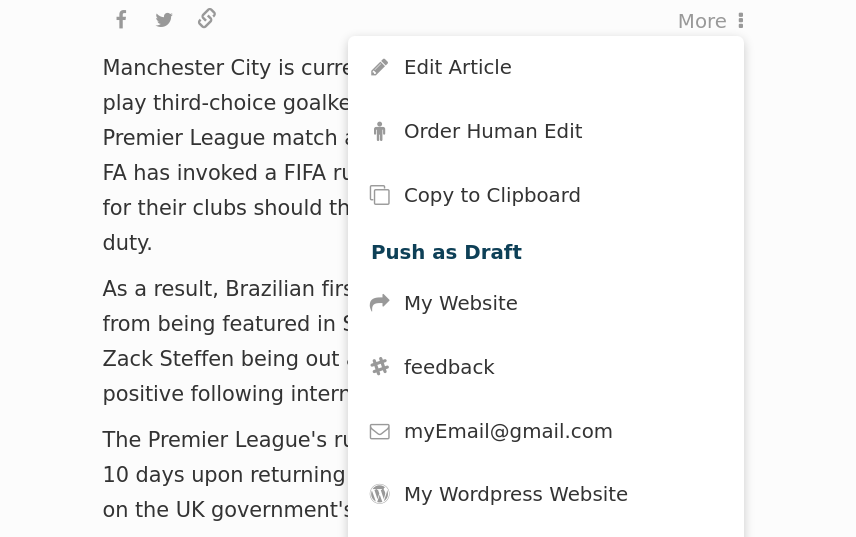
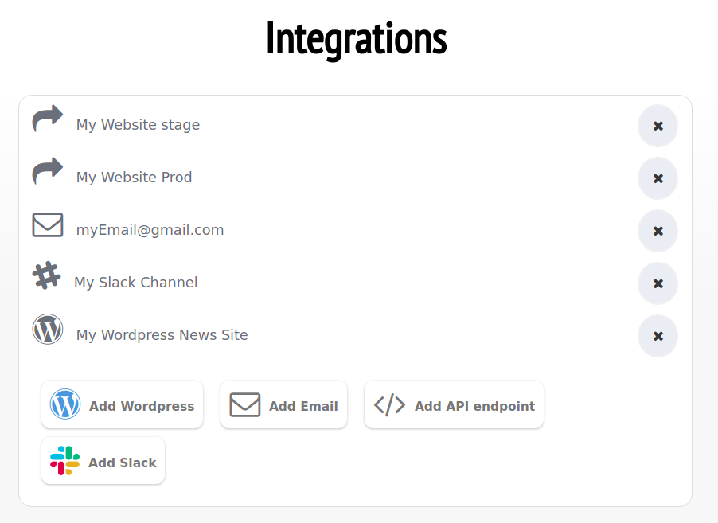

Integration
========

There are multiple ways of integrating with established publishing tools.
Monok allows the user to automatically generate a draft from
the chosen article, by pushing the content to their system of
choice. You can also automatically publish from Monok directly to your wordpress website, custom backend system or to your teams slack channel.

WordPress
--------

A wordpress plugin is available that allows you to push out any article of your choice to your WordPress admin as a new draft. Once the plugin is installed, a settings page will appear on your WordPress admin, where you can choose the default category, resolution of the featured image and other important settings.

Features
**********************

- Automatic category/section matching
- Automatic featured image setup
- Choose post type
- Choose the default author
- Quotes are styled according to your theme
- All embedded content is pushed (Youtube Video, Instagram Post, Twitter Post etc)
- Choose the resolution of photos
- Automatic interlinking to other posts on your site
- Keeping track of what your own team writes so to avoid duplicate

Installation
**********************
.. _`settings page`: https://www.monok.com/profile/settings

__ `settings page`_

1. Download the WordPress plugin from your `settings page`__ and install it in your WordPress admin for the website you wish to integrate with, it is important to remember that each user has a unique and private plugin, that contains your API key and should not be shared with others.

2. Go to your `monok profile`__ and check if your website has synced with Monok; if not, add the URL of your WordPress admin to your list of WordPress websites.

.. _`monok profile`: https://www.monok.com/profile

__ `monok profile`_

That's it, you can then start pushing out articles by opening up an article, pressing push to wordpress and chosing your wordpress url.

Troubleshooting
**********************

Many servers limit the amount of data you can send to them. When a thumbImageData field is sent, it can exceed that limit, thus yielding a `413 Payload Too Large`_ error. To resolve this issue, make sure your Nginx value for client_max_body_size is larger than 10mb.

In some cases, the website has limited POST and GET calls by restriction of endpoints through Nginx. To resolve this, open up the following endpoint:

website.com/wp-json/monok/*

The wildcard is there because there are two paths, Nginx configurations understand wildcards

If your Nginx setup resitricts IP's, open it up for this address: 51.15.93.77

Embedding content such as tweets is easy with Wordpress. By default Monok inserts the url for a youtube or a tweet as new line in the text. If you've disabled this feature on Wordpress, you can instead embed as HTML or as a shortcode.

Our shortcode for twitter is [twitter url="..."]

Clipboard
--------
By clicking "Copy to Clipboard" from the **More** dropdown menu, the article text and it's headline are automatically saved in your clipboard, enabling you to easily paste them into your editor of choice. 

Slack
--------
If you choose the slack integration you will be asked to sign in to your slack account unless you already are. You will be presented with a list of your channels and asked to select one. Once you've selected a channel it will be added in your integration and avialable from the dropdown menu of any article. You can the push an article out to this channel with the click of a button.

Email
--------
You are also given the option of pushing out an article by email to an email address of your choice.
In the same way one inserts a url for a wordpress website, you can also type in an email address. Press the "push to draft" button on an article once you've added the email address, to be presented with the list of emails and websites you've inputed. Click anyone to have an email automatically sent with the article.

.. _`413 Payload Too Large`: https://developer.mozilla.org/en-US/docs/Web/HTTP/Status/413
