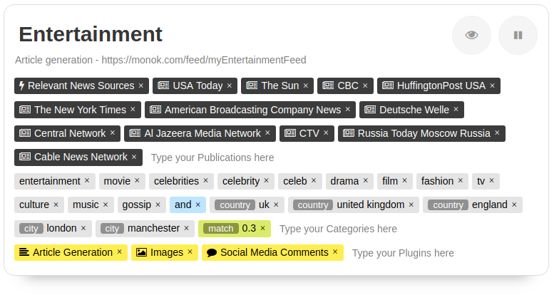
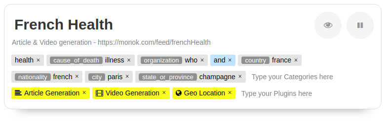

Setup Article Generation
========

Setting up an article generation news feed is done by using the profile page of your monok account.

1. Go to your profile page and add a new feed.
2. Insert the keywords for your query
3. chose the plugin "Article Generation"
4. Chose the publications/sources you wish to use or leave empty for all sources.

Example of a UK Entertainment News Feed
---------------------------------

In this example we'll set up an article generation feed for news about celebrities in relation to the united kingdom.
first we provide a list of publications, we chose the "Relevant News Articles" that will guess based on your query list of categories, the relevant source articles to use for your feed. If your query contains the word "music", it will automatically add and make use of news sources that are about music.
Alternatively we could just leave the publications feed empty, as it default on "All news sources" and will thus include all possible publications.

Next we type out our query, in this case we're interested in news about celebrities in relation the united kingdom, this can imply that a celebrity is british, or that they are visiting the UK or something similar.

Our Query is the following ::

    entertainment, movie, celebrities, celebrity, celeb, drama, film, fashion, tv, culture, music, gossip
    AND
    country:uk, country:united kingdom, country:england, city:london, city:manchester
    match:0.3

The first list is a list of categories, so an article must contain at least one of these categories, for instance "celebrity".
The second list after the "and" operand, is a second requirement for the article, in this case the article must contain at least one reference to either the country UK or England, or the city London or manchester.
Finally we demand with the "match" operand, that at least 30% of all the articles in any given cluster, must adhere to this query and match the rule, this ensures that no outlier article bundled in together with offtopic articles is matched as a relevant cluster.

Finally we chose the plugins we wish to run, in this example we've chosen the "Article Generation" plugin to generate an article text, but also the "Images" plugin that will search for and attach a relevant image that can be used for commercial projects, they are either public domain photos or under the creative commons license. Finally we've added the "Social Media Comments" to attach comments about this toppic to the article from twitter and reddit. These are not embeded but instead show up at the bottom as social media commentary.

**Some Example Outputs**

`Katharine McPhee says hubby David Foster and Prince Harry are 'like father and son'`_ - This is an article with youtube and instagram content

`The nominated British rapper dies from coronavirus at the age of 47`_ - This is an article with youtube, twitter and embeded video content as well as multiple social media comments

`Kevin Spacey complains about treatment over claims of sexual assault`_ - This article has an automatically attached relevant photo

.. _`Katharine McPhee says hubby David Foster and Prince Harry are 'like father and son'`: https://www.monok.com/puff/katharine-mcphee-says-hubby-david-foster-and-prince-harry-are-like-father-and-son

.. _`The nominated British rapper dies from coronavirus at the age of 47`: https://www.monok.com/puff/the-nominated-british-rapper-dies-from-coronavirus-at-the-age-of-47

.. _`Kevin Spacey complains about treatment over claims of sexual assault`: https://www.monok.com/puff/kevin-spacey-compares-sexual-abuse-allegations-to-the-coronavirus-and-says-i-understand-what-it-s-like-being-told-you-can-t-work

Example of a French Health Feed
--------------------------------------------

In this example, we're generating news videos with corresponding news articles, about health topics regarding france and french citizens. We make use of the "Video Generation" plugin that attempts to generate a video using the generated article text and corresponding fair use images and videos. We don't provide any publication sources, thus ensuring all possible sources are used to generate articles in this feed. Included in the plugin list is the "Geo Location" plugin, that attempts to detect the longitude and latitude of each article generated, so we may know where in France each article is mainly about.

Our Query is the following ::

    health, cause_of_death:illness, organization:who
    AND
    country:france, nationality:french, city:paris, state_or_province:champagne

We make use of the **organization** prefix to select articles that contain the abbreviation for the World Health Organization (WHO). You can read more about the different types of prefixes you can use at the Article `Query Selector`_

.. _`Query Selector`: https://docs.monok.com/en/latest/articlequeryselector.html
