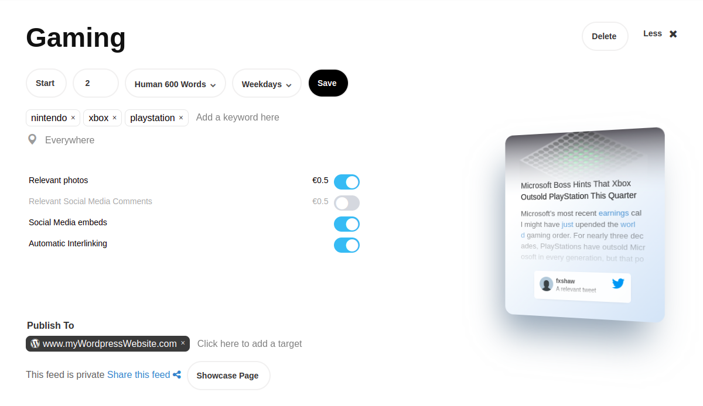
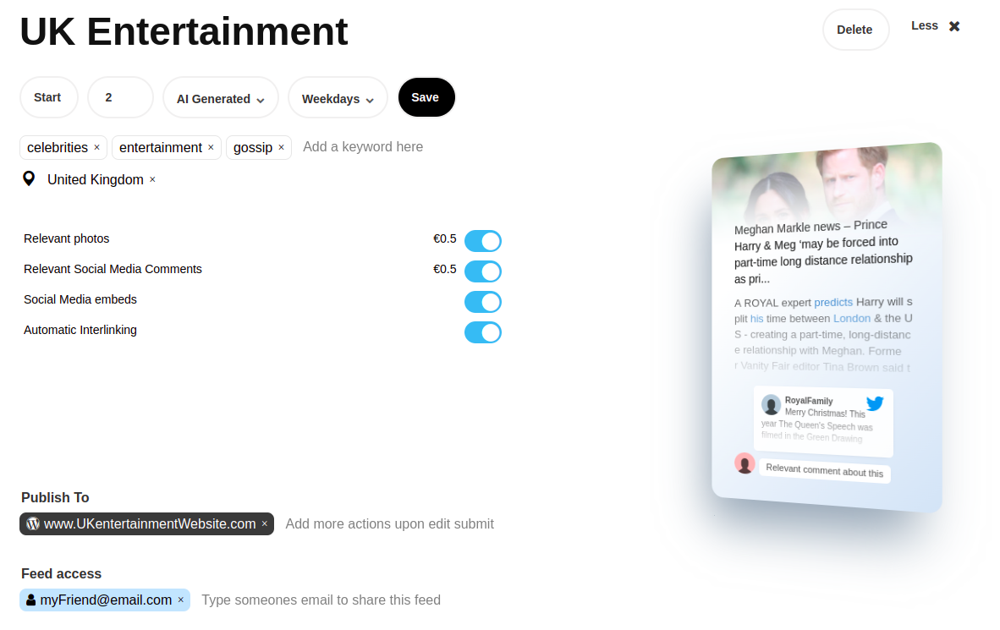

Setup Automatic Daily Feed
========

Setting up an article generation news feed is done by using the profile page of your monok account.

1. Go to your profile page and add a new feed.
2. Insert the keywords for your query and any relevant location, if any
3. Choose additional settings such as interlinking or social media embeds 

Example of a UK Entertainment News Feed
---------------------------------

In this example we've set up an article generation feed for news about gaming consoles. We've chosen 2 articles every Weekday (Mon-Fri). We've also chosen a 600 word human editing service, so articles are automatically passed through a human editor that expands and edits the articles. When the edits are finished and submitted, the article is automatically sent as a draft or published to the target website url.

Our Query is the following ::

    nintendo, xbox, playstation

We've also gone ahead and chosen interlinking so articles have links for previously published articles, as well as social media embeds for embeded tweets and youtube videos as well as the photos options that provides us with multiple photos for each article.

Example of a UK Entertainment Feed
--------------------------------------------

In this example, we're generating news from a restricted geographical area (United Kingdom). We've also chosen to go with just AI Generated drafts, where no human is involved. We're also sharing the feed with a friend of ours.

Our Query is the following ::

    celebrties, entertainment, gossip

You can read more about the different types of prefixes you can use to enhance your `Query Selector`_

**Some Example Outputs for "UK Entertainment"**

`Katharine McPhee says hubby David Foster and Prince Harry are 'like father and son'`_ - This is an article with youtube and instagram content

`The nominated British rapper dies from coronavirus at the age of 47`_ - This is an article with youtube, twitter and embeded video content as well as multiple social media comments

`Kevin Spacey complains about treatment over claims of sexual assault`_ - This article has an automatically attached relevant photo

.. _`Katharine McPhee says hubby David Foster and Prince Harry are 'like father and son'`: https://www.monok.com/puff/katharine-mcphee-says-hubby-david-foster-and-prince-harry-are-like-father-and-son

.. _`The nominated British rapper dies from coronavirus at the age of 47`: https://www.monok.com/puff/the-nominated-british-rapper-dies-from-coronavirus-at-the-age-of-47

.. _`Kevin Spacey complains about treatment over claims of sexual assault`: https://www.monok.com/puff/kevin-spacey-compares-sexual-abuse-allegations-to-the-coronavirus-and-says-i-understand-what-it-s-like-being-told-you-can-t-work

.. _`Query Selector`: https://docs.monok.com/en/latest/articlequeryselector.html
