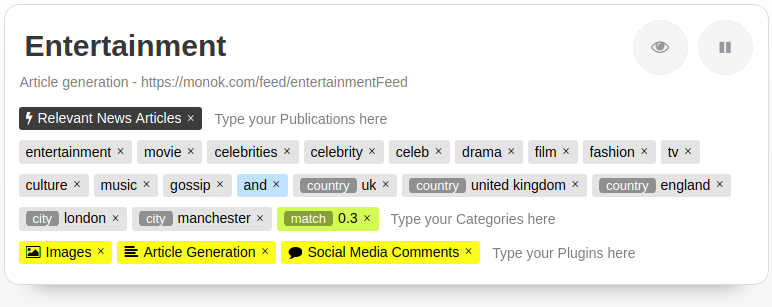

Setup Article Generation
========

Setting up an article generation news feed is done by using the profile page of your monok account.

1. Go to your profile page and add a new feed.
2. Insert the keywords for your query
3. chose the plugin "Article Generation"
3. Chose the publications/sources you wish to use or leave empty for all sources.

Example of a UK Entertainment News Feed
---------------------------------

In this example we'll set up an article generation feed for news about celebrities in relation to the united kingdom.
first we provide a list of publications, we chose the "Relevant News Sources" that will guess based on your query list of categories, the relevant publications for your feed. If your query contains the word "music", it will automatically add and make use of news sources that have music dedicated pages. Furthermore, we add another 12 news sources that we demand to be part of the sources, they may or may not contain relevant articles, but we would like to include them nonetheless. Alternatively we could just leave the publications feed empty, as it default on "All news sources" and will thus include all possible publications.

Next we type out our query, in this case we're interested in news about celebrities in relation the united kingdom, this can imply that a celebrity is british, or that they are visiting the UK or something similar.

Our Query is the following ::

    entertainment, movie, celebrities, celebrity, celeb, drama, film, fashion, tv, culture, music, gossip
    AND
    country:uk, country:united kingdom, country:england, city:london, city:manchester
    match:0.3

The first list is a list of categories, so an article must contain at least one of these categories, for instance "celebrity".
The second list after the "and" operand, is a second requirement for the article, in this case the article must contain at least one reference to either the country UK or England, or the city London or manchester.
Finally we demand with the "match" operand, that at least 30% of all the articles in any given cluster, must adhere to this query and match the rule, this ensures that no outlier article bundled in together with offtopic articles is matched as a relevant cluster.

Finally we chose the plugins we wish to run, in this example we've chosen the "Article Generation" plugin to generate an article text, but also the "Images" plugin that will search for and attach a relevant image that can be used for commercial projects, they are either public domain photos or under the creative commons license. Finally we've added the "Social Media Comments" to attach comments about this toppic to the article from twitter and reddit. These are not embeded but instead show up at the bottom as social media commentary.

Example of a Business News Feed
--------------------------------------------
